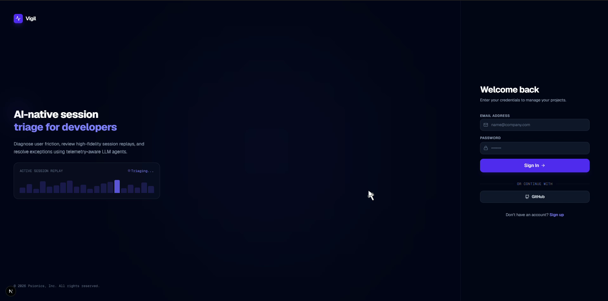
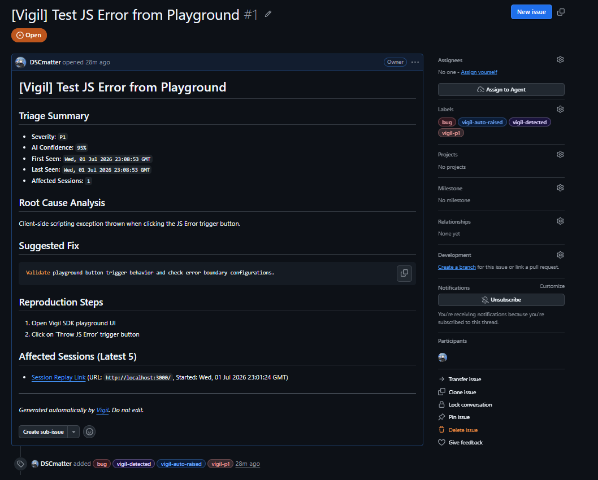

# Vigil

AI-first bug triage from real user sessions. Vigil watches your users, groups repeated failures, and turns them into developer-ready GitHub issues — automatically.

---

## What It Does

Vigil is not a session replay tool. Replay is evidence. The product is the triage loop:

- **Captures** broken UX signals automatically — JS errors, network failures, rage clicks, dead clicks — as they happen in real user sessions, then runs AI triage post-session.
- **Groups** repeated failures across sessions into a single issue. 500 users hitting the same bug → 1 issue, not 500 reports.
- **Writes** developer-ready bug reports: root cause, reproduction steps, suggested fix, severity, and supporting evidence.
- **Raises** GitHub issues pre-filled by AI, one per issue group, with optional auto-raise for high-confidence P0/P1s.

## How It Works

1. **Record** — install `@vigil/sdk`. Captures DOM mutations, clicks, scrolls, masked inputs, console errors, JS exceptions, network failures, and navigations using rrweb. No raw input values leave the browser.
2. **Ingest** — events are batched and flushed to Vigil's ingest API. Sessions are processed asynchronously and non-noise sessions enter the triage pipeline automatically.
3. **Triage** — the AI makes a verdict on every session: normal behavior, a new bug, or a duplicate of a known failure. Repeated failures cluster into a single issue group — not one report per affected user.
4. **Act** — developers work from a prioritized issue queue, not a list of sessions. Each issue comes with AI-written root cause, reproduction steps, a suggested fix, and a one-click path to a pre-filled GitHub issue.

## Demo

Example Issue created by Github Integration: 

## Stack

| Layer | Choice |
|---|---|
| SDK | TypeScript + rrweb |
| Backend | Node.js + Hono |
| Frontend | Next.js |
| Database | Neon (Postgres) |
| Blob storage | Local disk (dev) → R2/S3 (prod) |
| AI | Openrouter (current) --> OpenAI/Anthropic (future) |
| GitHub | Octokit |

## License

Source-available under the [Business Source License 1.1](LICENSE).
Non-production use, small-business use, and contributions are free.
Commercial hosting as a service requires a license.

After four years from first publication, the code automatically converts to MIT.

## Contributing

See [CONTRIBUTING.md](CONTRIBUTING.md) for local setup, code style, and the PR workflow.

## Security

See [SECURITY.md](SECURITY.md) for our vulnerability disclosure process.

## Docs

- [Product Spec](docs/vigil-product-spec.md)
- [System Architecture](docs/vigil-architecture.md)
- [Data Schema](docs/vigil-data-schema.md)
- [SDK Contract](docs/vigil-sdk-contract.md)
- [Testing Guide](TEST.md)
