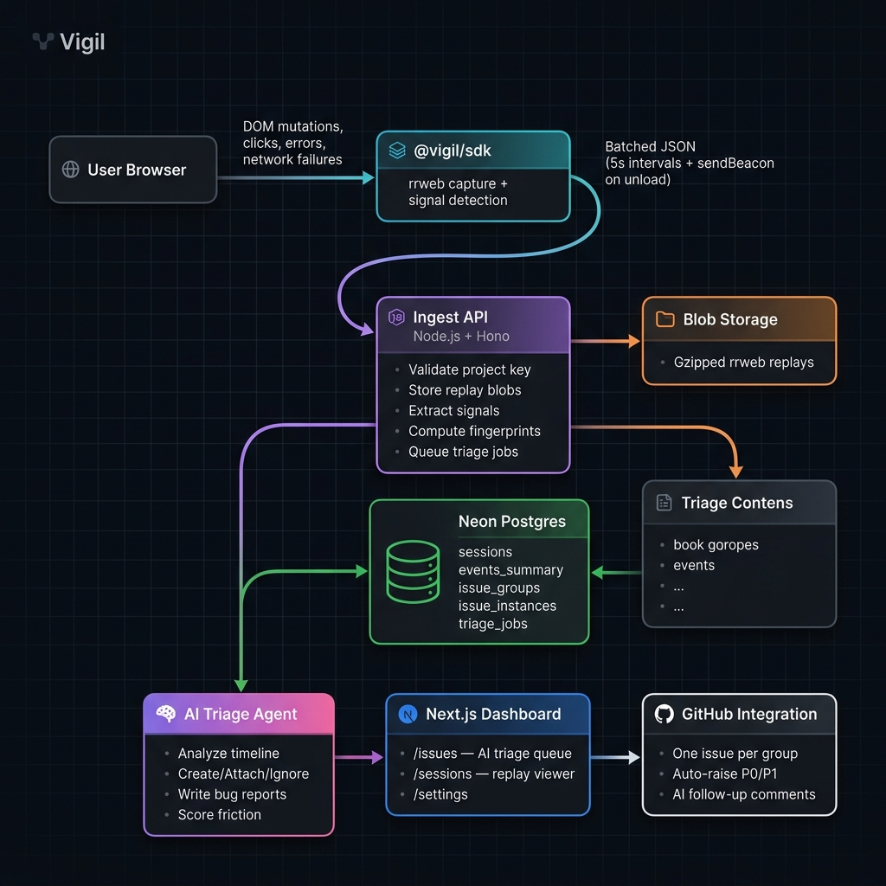
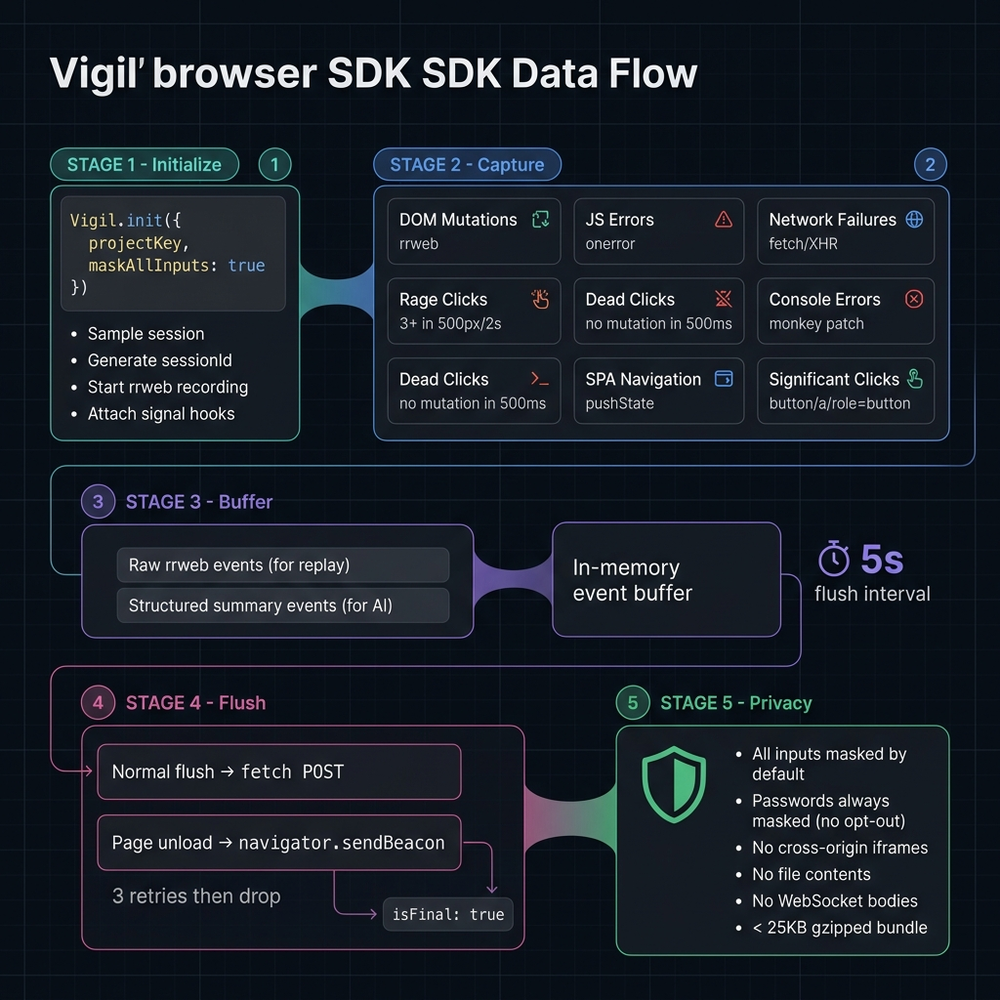
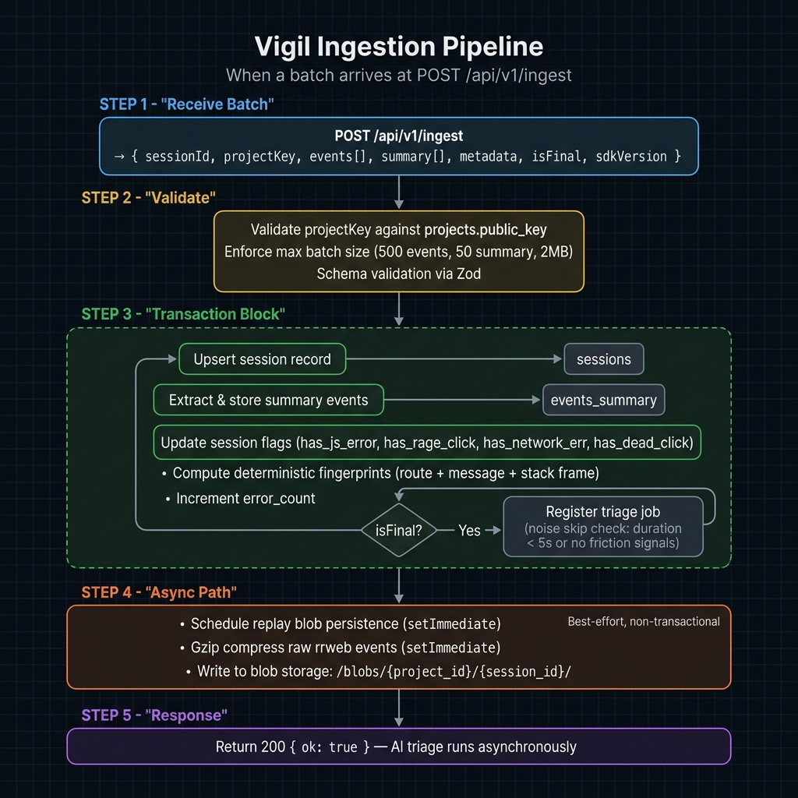
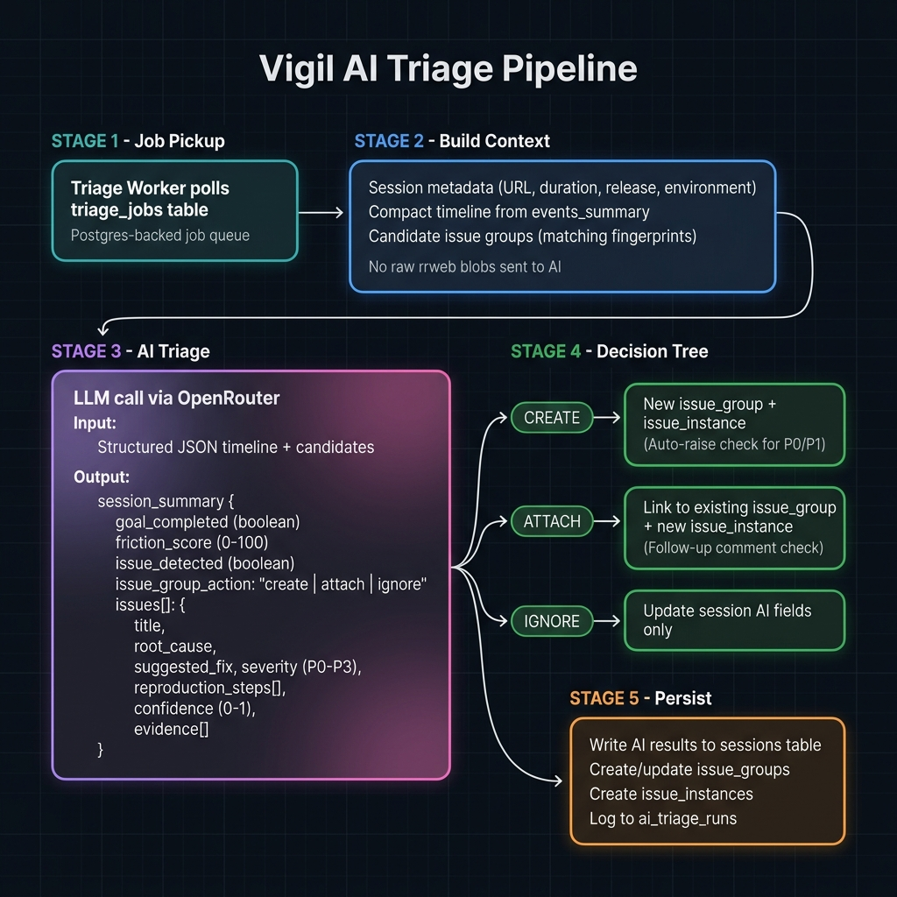
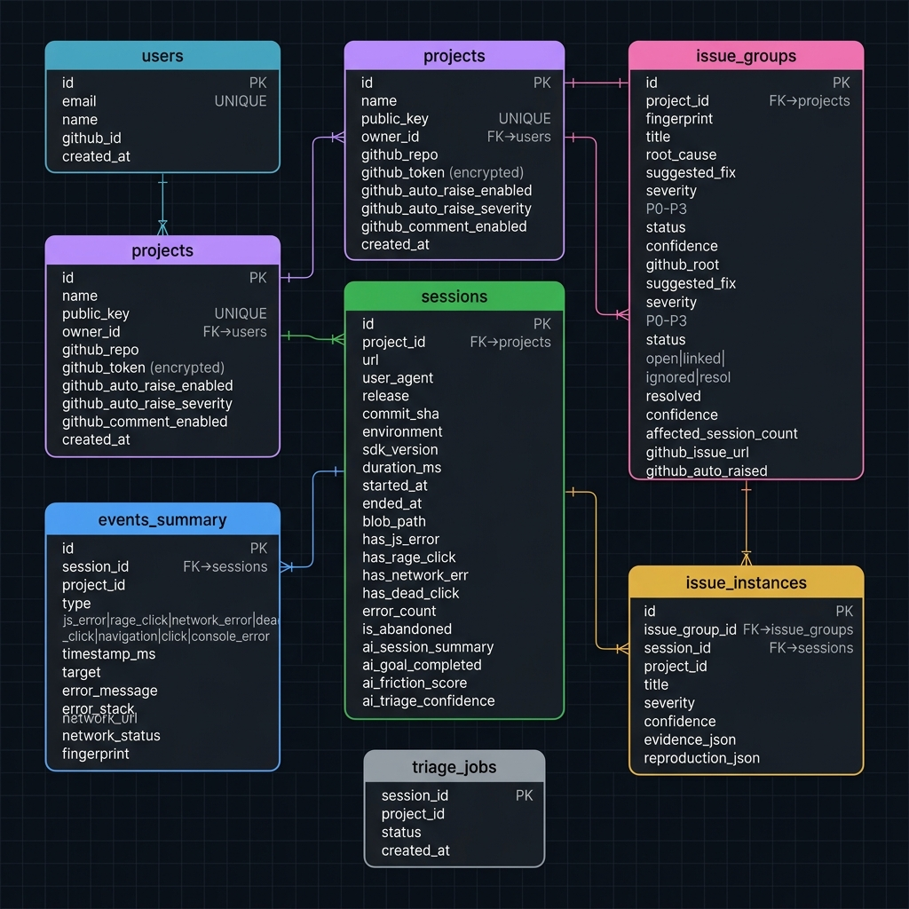

<p align="center">
  <strong>Vigil</strong><br/>
  AI-first bug triage from real user sessions
</p>

<p align="center">
  <a href="docs/vigil-architecture.md">Architecture</a> ·
  <a href="docs/vigil-product-spec.md">Product Spec</a> ·
  <a href="docs/vigil-data-schema.md">Data Schema</a> ·
  <a href="docs/vigil-sdk-contract.md">SDK Contract</a> ·
  <a href="CONTRIBUTING.md">Contributing</a>
</p>

---

## What is Vigil?

Vigil is an AI-native bug triage platform that watches real user sessions, detects broken UX automatically, and turns failures into developer-ready GitHub issues.

**It is not a session replay tool.** Replay is evidence. The product is the AI triage loop:

1. **Captures** broken UX signals — JS errors, network failures, rage clicks, dead clicks — as they happen in production browser sessions.
2. **Groups** repeated failures across sessions into a single issue. 500 users hitting the same bug → 1 issue, not 500 reports.
3. **Writes** developer-ready bug reports: root cause analysis, reproduction steps, suggested fix, severity, confidence, and supporting evidence.
4. **Raises** GitHub issues pre-filled by AI, one per issue group, with optional auto-raise for high-confidence P0/P1s.

### Demo

[](https://github.com/Psionic-labs/Vigil/blob/main/demo/demo.mp4)

Example issue created by the GitHub integration:


---

## Why does Vigil exist?

Users encounter bugs they never report. Traditional error monitoring tools like Sentry give you stack traces without context. Session replay tools like LogRocket give you recordings without triage. Developers are left manually watching replays, classifying bugs, grouping duplicates, and writing reports.

Vigil closes this gap by making the AI own the triage decision:

- **Is this session normal, noisy, or broken?**
- **What was the user trying to do? Did they succeed?**
- **What went wrong, and how do you reproduce it?**
- **Is this a new bug or a duplicate of something already known?**

The result is a prioritized issue queue that developers work from directly — not a wall of raw sessions or uncontextualized stack traces.

---

## Why is it technically interesting?

### AI as the product, not a feature

Most monitoring tools bolt AI onto an existing workflow as a summarization layer. Vigil inverts this: the AI **owns** the core triage decision (create, attach, or ignore), and deterministic systems (fingerprinting, signal extraction, replay storage) exist to make the AI cheaper, faster, and auditable.

### Dual-track data architecture

The SDK separates data into two streams at capture time:
- **Raw rrweb events** → stored as gzipped blobs for replay only. The AI never sees these.
- **Structured summary events** → normalized, fingerprinted, and fed to the AI as compact JSON timelines.

This design keeps AI token costs bounded, prevents PII leakage into model inputs, and makes triage outputs auditable against concrete event evidence.

### Deterministic fingerprinting + AI judgment

Before the AI runs, every signal gets a deterministic fingerprint (route + normalized error + top stack frame, or route + method + URL + status code). These fingerprints produce candidate issue groups that the AI can accept, reject, or override. The AI makes the final call, but fingerprints eliminate most noise and reduce the search space.

### Transactional ingest, async AI

The ingest pipeline uses Postgres transactions for all session state mutations, signal extraction, and job registration — guaranteeing consistency even under retries. Heavy work (replay blob compression, AI triage) runs asynchronously outside the request path. This keeps ingest latency low while ensuring no data loss.

### Session timeout reconciliation

To handle browsers that crash, close, or go to sleep without sending a final flush, a background worker scans for abandoned sessions and transitions them using a partial Postgres index. Late-arriving final flushes correctly un-abandon the session.

---

## Architecture

### System Overview

<p align="center">
  
</p>

The system follows a pipeline architecture:

```
Browser → SDK → Ingest API → Signal Extraction → AI Triage → Issue Groups → Dashboard → GitHub
```

| Layer | Technology | Purpose |
|---|---|---|
| SDK | TypeScript + rrweb | Browser-side capture of DOM, errors, clicks, network failures |
| Backend | Node.js + Hono | Ingest API, signal processing, AI orchestration, GitHub integration |
| Frontend | Next.js + Tailwind | Issues dashboard, session replay, settings |
| Database | Neon (Postgres) | Sessions, events, issue groups, job queue |
| Blob storage | Local disk (dev) → R2/S3 (prod) | Gzipped rrweb replay blobs |
| AI | OpenRouter (LLM routing) | Triage decisions, bug report generation |
| GitHub | Octokit | Issue creation, auto-raise, follow-up comments |
| Auth | Better Auth | Dashboard authentication |
| Build | Turborepo + pnpm | Monorepo orchestration |

---

### SDK Flow

<p align="center">
  
</p>

The SDK (`@vigil/sdk`) is a thin TypeScript wrapper around `rrweb/record` (~25KB gzipped). It captures eight signal types:

| Signal | Detection Method |
|---|---|
| DOM mutations & scroll | rrweb core recording |
| JS exceptions | `window.onerror` + `onunhandledrejection` |
| Console errors | `console.error` monkey patch |
| Network failures | `fetch` and `XMLHttpRequest` interception (4xx/5xx) |
| Rage clicks | 3+ clicks in same 500px area within 2s |
| Dead clicks | Click with no DOM mutation or navigation within 500ms |
| SPA navigations | `pushState`, `replaceState`, `popstate` |
| Significant clicks | Clicks on `button`, `a`, `[role=button]` elements |

Events buffer in memory and flush every 5 seconds via `fetch`, with a final `navigator.sendBeacon` flush on page unload. All text inputs are masked by default; passwords are always masked with no opt-out.

---

### Ingestion Pipeline

<p align="center">
  
</p>

When a batch arrives at `POST /api/v1/ingest`:

1. **Validate** — Project key lookup, Zod schema validation, size limits (500 events, 50 summary events, 2MB per flush).
2. **Transaction** — Inside a single Postgres transaction:
   - Upsert session record
   - Batch-insert normalized summary events into `events_summary`
   - Update session flags (`has_js_error`, `has_rage_click`, `has_network_err`, `has_dead_click`)
   - Compute deterministic fingerprints
   - On `isFinal: true`: register a triage job (unless noise-skipped)
3. **Async** — After the response, schedule replay blob persistence via `setImmediate` (gzip compress + write to disk).
4. **Respond** — Return `200 { ok: true }`. AI triage runs asynchronously.

**Noise skip heuristics**: Sessions under 5 seconds or with zero friction signals skip AI triage entirely.

---

### AI Pipeline

<p align="center">
  
</p>

The triage worker picks jobs from a Postgres-backed queue and runs each session through the AI:

1. **Build context** — Assemble a compact JSON timeline from `events_summary`, session metadata, and candidate issue groups matched by fingerprint.
2. **Triage** — Send structured input to the LLM. The AI returns:
   - Session summary, goal completion, friction score (0-100)
   - Issue detection with `create` / `attach` / `ignore` action
   - Per-issue: title, root cause, suggested fix, severity (P0–P3), reproduction steps, confidence (0–1), evidence
3. **Persist** — Based on the AI decision:
   - **Create**: New `issue_group` + `issue_instance`. If P0/P1 with sufficient confidence and auto-raise is enabled, a GitHub issue is created automatically.
   - **Attach**: Link to existing `issue_group`, create new `issue_instance`. Optionally post a follow-up comment on the existing GitHub issue.
   - **Ignore**: Update session-level AI fields only.

The AI never receives raw rrweb replay blobs — only structured summary timelines.

---

### Database Schema

<p align="center">
  
</p>

Core tables and their roles:

| Table | Purpose |
|---|---|
| `users` | Dashboard accounts |
| `projects` | Monitored apps, each with a unique `public_key` for SDK auth |
| `sessions` | One row per browser session — metadata, flags, AI results |
| `events_summary` | Normalized signal events extracted from SDK payloads |
| `issue_groups` | Deduplicated developer-facing issues (the primary product object) |
| `issue_instances` | Per-session evidence linking a session to an issue group |
| `triage_jobs` | Postgres-backed job queue for async AI triage |
| `ai_triage_runs` | Audit log for model behavior (prompt version, tokens, errors) |

Full schema DDL with indexes: [vigil-data-schema.md](docs/vigil-data-schema.md)

---

## Project Structure

```
vigil/
├── apps/
│   ├── api/            # Hono backend — ingest, auth, triage worker, GitHub integration
│   ├── web/            # Next.js dashboard — issues, sessions, replay, settings
│   └── playground/     # Local dev playground for testing the SDK
├── packages/
│   └── sdk/            # @vigil/sdk — browser instrumentation library
├── docs/               # Architecture, schema, product spec, SDK contract
│   └── images/          # Architecture diagrams (PNG)
└── .github/
    └── workflows/      # CI pipeline (lint → typecheck → test → build → size audit)
```

---

## How to Run

### Prerequisites

- **Node.js** ≥ 22 (see `.nvmrc`)
- **pnpm** 11.x (`corepack enable` if using corepack)
- **Neon Postgres** database ([neon.tech](https://neon.tech) — free tier works)
- **OpenRouter API key** ([openrouter.ai](https://openrouter.ai)) for AI triage

### Setup

```bash
# Clone
git clone https://github.com/Psionic-labs/Vigil.git
cd Vigil

# Install dependencies
pnpm install

# Configure environment
cp apps/api/.env.example apps/api/.env
# Edit apps/api/.env with your DATABASE_URL, OPENROUTER_API_KEY, etc.

# Run database migrations
pnpm --filter @vigil/api db:migrate

# Seed demo data (optional)
pnpm --filter @vigil/api db:seed
```

### Development

```bash
# Start all services (API on :3001, Web on :3002, SDK in watch mode)
pnpm run dev

# Or start individual services
pnpm --filter @vigil/api dev         # API server
pnpm --filter web dev                # Next.js dashboard
pnpm --filter @vigil/sdk dev         # SDK build watcher
pnpm --filter @vigil/api worker:dev  # AI triage worker
```

### Testing

```bash
# Run the full local test suite
pnpm run test:local

# Individual checks
pnpm run lint                         # ESLint across all packages
pnpm run typecheck                    # TypeScript strict mode
pnpm --filter @vigil/sdk test         # SDK unit tests
pnpm --filter @vigil/api test         # API unit tests
pnpm run build                        # Production build
pnpm --filter @vigil/sdk track-size   # Bundle size audit (<25KB gzipped)
```

### Environment Variables

| Variable | Required | Description |
|---|---|---|
| `DATABASE_URL` | Yes | Neon Postgres connection string |
| `OPENROUTER_API_KEY` | Yes | API key for LLM triage |
| `TRIAGE_MODEL` | Yes | Model identifier for triage (e.g., `anthropic/claude-sonnet-4`) |
| `GITHUB_CLIENT_ID` | For GitHub | OAuth App client ID |
| `GITHUB_CLIENT_SECRET` | For GitHub | OAuth App client secret |
| `GITHUB_TOKEN_ENCRYPTION_KEY` | For GitHub | AES key for token encryption at rest |
| `MOCK_AI` | No | Set to `"true"` to skip real AI calls during dev |
| `FRONTEND_URL` | No | Dashboard URL for CORS (default: `http://localhost:3002`) |

---

## License

Source-available under the [Business Source License 1.1](LICENSE).

- Non-production use, development, testing, and contributions are always permitted.
- Internal use by any organization is permitted.
- Small businesses (<25 employees, <$1M revenue) may use Vigil for any purpose.
- Hosting Vigil as a managed service for third parties requires a commercial license.
- On **2030-07-02**, the code automatically converts to **MIT**.

BSL is not an OSI-approved open-source license. For commercial licensing, contact [Psionics](https://github.com/Psionic-labs).

## Contributing

See [CONTRIBUTING.md](CONTRIBUTING.md) for local setup, code style, and the PR workflow.

## Security

See [SECURITY.md](SECURITY.md) for our vulnerability disclosure process.
