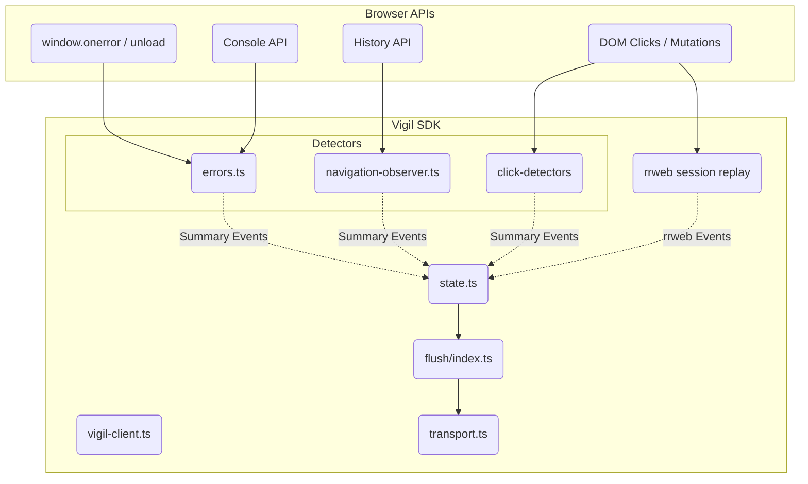

# Vigil SDK Architecture

Welcome to the internal engineering architecture documentation for the Vigil SDK.

The SDK is designed as a lightweight, privacy-focused, and highly reliable observability agent that captures DOM replays, interactions, and console errors, reliably flushing them to a remote ingest endpoint.

This documentation serves as a guide for maintainers, contributors, and those auditing the SDK's lifecycle semantics.

## Architecture Documentation Map

To avoid monolithic documentation, our architecture details are separated into logical boundaries:

1. [Core Lifecycle & Initialization](01-core-lifecycle.md)
   *How the SDK boots up, manages its global state, and ensures reliable teardown.*
2. [Flush & Transport Semantics](02-flush-and-transport.md)
   *How the SDK safely moves data off the device, handling retries, visibility changes, and terminal unwinding.*
3. [Session & State Management](03-session-and-state.md)
   *How we define a session, handle sampling, and manage storage constraints.*
4. [Detectors](04-detectors.md)
   *How we instrument the DOM and globals for rage clicks, dead clicks, SPA navigations, and errors.*
5. [Replay System (rrweb)](05-replay-system.md)
   *How we manage the heavy DOM snapshotting and replay integration safely.*
6. [Playground & Debug Tooling](06-playground.md)
   *How we validate the SDK internally without a full observability stack.*

## High-Level Architecture Diagram

## Architectural Tradeoffs

When maintaining the SDK, be aware of these foundational tradeoffs:
* **`rrweb` Bundle Dominance**: The `rrweb` snapshotting logic is responsible for >80% of our payload. We intentionally accept this large payload footprint because high-fidelity DOM replay is a core product requirement, prioritizing product value over strict micro-bundle optimization.
* **Visibility Flush Duplication**: When the tab becomes hidden, we opportunistically flush the buffer but do NOT drain the events (unless it's an unload). This is an intentional tradeoff: we accept minor data duplication in exchange for guaranteeing data is preserved if the browser is force-killed.
* **Minimal Abstractions**: The SDK heavily avoids framework usage (no internal RxJS, no external storage wrappers). Internal reactivity is purely procedural.

## Contributor Guidelines

If you are adding new features to the SDK, follow these rules:
1. **Never leak listeners**: Any detector that uses `addEventListener` or wraps global APIs *must* return a cleanup function. Register this cleanup function with the `createLifecycleManager` in `vigil-client.ts`.
2. **Respect `finalFlushSent`**: Never queue new events or attempt network requests if `state.finalFlushSent` is `true`. The SDK is considered dead at that point.
3. **Use the Playground**: When testing new detectors, always validate them manually in `apps/playground`. Do not rely solely on `vitest` because JSDOM lifecycle APIs (`pagehide`, `visibilitychange`) do not emulate real browser freezing accurately.
