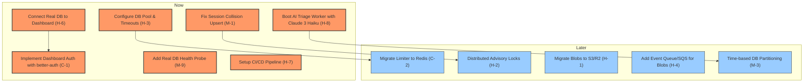

# Prioritized Implementation Roadmap — Vigil Ingest & Telemetry Platform

This document categorizes the findings from the [Production Readiness Review](review.md) into actionable execution phases. It separates **immediate functional and security blockers** (feasible now) from **high-scale horizontal and optimization requirements** (to do later), incorporating the production choices of **better-auth** for dashboard security and **Claude 3 Haiku** for the AI triage processing loop.

---

## 1. Roadmap Sequence Overview

---

## 2. Phase 1: Critical Right Now (Pre-Launch / Closed Beta)

These tasks address immediate functional blockers (the application is unusable without them), low-effort stability improvements, or critical security holes.

### 2.1 Functional Blockers
| Finding | File | Description | Action Required | Effort |
| :--- | :--- | :--- | :--- | :--- |
| **H-6: Mock Dashboard** | [page.tsx](../apps/web/app/page.tsx) | The entire dashboard renders from static mock arrays. No real database records can be retrieved. | Write Next.js API routes or Server Actions to query sessions, issues, and timeline tables. | High |
| **H-8: AI Triage Worker** | [0003_add_triage_jobs.sql](../apps/api/migrations/0003_add_triage_jobs.sql) | Telemetry ingestion enqueues triage jobs, but no worker script is consuming them. | Build a polling triage worker using Postgres `FOR UPDATE SKIP LOCKED` and assemble LLM prompts using **Claude 3 Haiku** for cost efficiency and fast triage. | Medium-High |

### 2.2 Low-Effort, High-Payoff Hardening
| Finding | File | Description | Action Required | Effort |
| :--- | :--- | :--- | :--- | :--- |
| **H-3: DB Pool Tuning** | [db.ts](../apps/api/src/db.ts) | Missing connection pool limits and statement timeouts make the API vulnerable to serverless connection exhaustion. | Tune database client constructor with `max: 20`, `idleTimeoutMillis: 30000`, and `statement_timeout: 5000`. | Trivial |
| **M-9: Health Probe** | [health.ts](../apps/api/src/routes/health.ts) | `/health` endpoint blindly returns `200` without verifying active database connectivity. | Call `checkDatabaseConnection()` and return `503 Service Unavailable` on database connection failure. | Small |
| **M-2: Migration Transactions** | [migrate.ts](../apps/api/scripts/migrate.ts) | Individual migrations execute outside SQL transactions, risking half-applied schemas on script failures. | Wrap migration reads/writes in standard SQL `BEGIN`/`COMMIT` transactions. | Small |
| **H-7: CI/CD Pipeline** | [.github/workflows](../.github/workflows) | No automated test/lint/typecheck execution on pull requests or commits. | Create a simple GitHub Actions workflow executing `lint`, `typecheck`, and `test` suites. | Small |

### 2.3 Security & Data Safety
| Finding | File | Description | Action Required | Effort |
| :--- | :--- | :--- | :--- | :--- |
| **C-1: Dashboard Auth** | [app.ts](../apps/api/src/app.ts) | No authentication gates the dashboard, allowing any user with the URL to view all tenants' telemetry. | Set up **better-auth** and register auth middleware on all non-ingest routes. | Medium |
| **M-1: Session Collision** | [ingest.ts](../apps/api/src/routes/ingest.ts) | Clients generate session IDs. Conflict upsert does not verify that the conflicting session belongs to the same project. | Add a `WHERE` guard to the conflict statement: `WHERE sessions.project_id = EXCLUDED.project_id`. | Small |

---

## 3. Phase 2: Scale & Production (Defer to Future)

These tasks are only required once you horizontally scale the API across multiple instances, or exceed 10+ million records. Deferring them now simplifies MVP development.

### 3.1 Horizontal Scale (Multi-Instance Deployment)
- **C-2: Redis Rate Limiting Store:**
  - *Why Defer:* The in-memory token bucket implementation works perfectly on a single server. Redis is only required when load-balancers distribute requests across multiple distinct server instances.
  - *Action:* Re-implement `LimiterStore` using a Redis backend. The controller routes require zero changes since interfaces are decoupled.
- **H-2: Distributed Locks for Workers:**
  - *Why Defer:* The reconciliation loop is process-local. To scale horizontally without duplicate worker runs, introduce Postgres advisory locks (`pg_advisory_lock`) to coordinate instances.
- **H-1: Object Storage (S3/R2):**
  - *Why Defer:* Local disk storage is fine for a single instance. Defer the migration to AWS S3 or Cloudflare R2 until you need multi-server file sharing and automatic retention cycles.

### 3.2 High-Volume Optimizations
- **M-3: `events_summary` Partitioning:**
  - *Why Defer:* At launch, single-table indices suffice. You only need time-based partitioning (monthly/weekly chunks) or a migration to ClickHouse when you reach tens of millions of rows.
- **H-4: Async Blob Queue (SQS/Redis Streams):**
  - *Why Defer:* Currently, if the API server crashes immediately after sending a 200 but before the background disk write finishes, the replay is lost. Durable queues are complex and can be deferred.

---

## 4. Execution Plan Checklist

- [ ] **Step 1: DB Pool Constraints** (Trivial) — Configure pool connections and query timeouts in `db.ts`.
- [ ] **Step 2: Session Upsert Guard** (Small) — Add projectKey constraint to ingest session upsert.
- [ ] **Step 3: Database Liveness Probe** (Small) — Integrate DB connection verification into `/health`.
- [ ] **Step 4: Migration Transactions** (Small) — Wrap migration executions in SQL transactions.
- [ ] **Step 5: CI Pipeline** (Small) — Build automated GitHub Actions lint/test workflow.
- [ ] **Step 6: Real Dashboard Views** (High) — Connect web app tables to SQL data fetching.
- [ ] **Step 7: AI Triage Worker** (Medium-High) — Start background job polling and processing triage queue using Claude 3 Haiku.
- [ ] **Step 8: Authentication** (Medium) — GATE all dashboard routes with better-auth.
